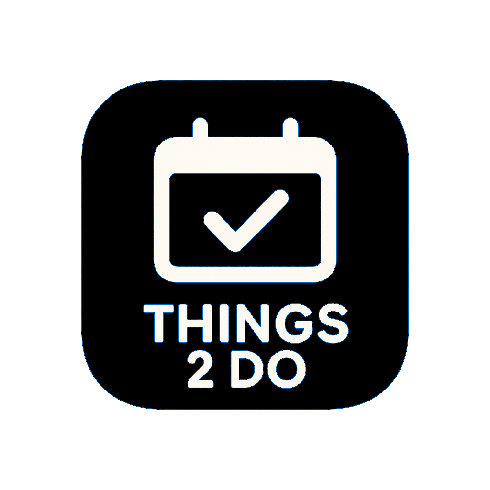

<h1 align="center">Things2Do</h1>
<div align="center">
  
</div>

## Overview

Things2Do is a mobile app that helps users find interesting events, activities, or locations near their location for them to attend. Users can swipe right on these events to save them to their "ThingDeck" (a list of the user's saved events). Users have the option to later delete those events from their ThingDeck if desired.

People and businesses can also promote their own events by creating them on the app, where it'll then be discoverable by other users in the Discovery page. Users can also leave reviews on other users/businesses related to their created events.

## How to Install the Software (Prerequisite Software)

The application depends on a few other software that are required before building and running the system. A list of them, along with the required/recommended version and a link to their installation instructiions, are provided below:

### 1. Node.js (v24.11.1 LTS recommended)
- Download: https://nodejs.org/en/download
- Choose the installer that matches your OS and CPU architecture.
- Installing Node.js also installs npm.

### 2. Expo Go (for testing on a mobile device)
Latest version recommended.
- **Android:**  
  https://play.google.com/store/apps/details?id=host.exp.exponent
- **Emulator**
  - If testing on the emulator ensure you download expo go on the playstore. 

### 3. Android Studio & Emulator (for testing on a computer)

#### Installation Steps
1. [Download Android Studio (Otter release)](https://developer.android.com/studio)
2. Install Android Studio and accept all required SDK components/dependencies.
3. Open Android Studio.
4. In the left sidebar, click **Projects**.
5. Click **More Actions** in the center of the screen.
6. Select **Virtual Device Manager**.
7. Launch **“Medium Phone API 36.1”**.
   - This is a full Android emulator.

- Notes
  -  Virtualization must be supported on your pc to use the android SDK emulator.
  - for ubuntu systems, ensure KVM extenstion is  enabled:
    ```
      sudo modprobe kvm
      sudo modprobe kvm_intel   # Intel only
      sudo modprobe kvm_amd     # AMD only
    ```

---
## Getting Started (Running/Building the App)

Follow these steps to build and run the Things2Do app.

### 1. Clone the Repository

Open up a command-line interface (e.g., Terminal, Command Prompt, PowerShell), navigate to a location on your file system where you'd like to hold the project's files, and run this command:

```bash
git clone https://github.com/MRU-F2025-COMP3504/3504-term-project-things2do.git
```

### 2. Install Dependencies

Make sure you've installed [Node.js in the previous section](#how-to-install-the-software-prerequisite-software) (which should've also installed npm), then run this command from the root directory of the repository you just cloned:

```bash
npm install
```

### 3. Running the App

You can run the app from the web, on an android device, or on an Android emulator.

#### Option A: Run on a Android Device (Expo Go + QR code)

```bash
npx expo start
```

- This runs the application from the command line.
- Scan the QR code with the **Expo Go** app (Android or iOS).
- The app will load on your phone.
- Although there are no specific OS version requirements, you must have Android device if you choose to use this option for running the mobile application.

#### Option B: Run on Android Emulator

Make sure your Android emulator is already running, then run:

```bash
npx expo start --android
```

- This installs and launches the app in the emulator.
- If the app doesn’t refresh, press `r` in the terminal or use the reload button in the Expo console.
- Once the app is running, you can log in **anonymously** — no account or credentials are required.

## Using the Software

> [!IMPORTANT]
> Before using the features of the application, please make sure you've completed the [Prerequisites for Using the Features](#prerequisites-for-using-the-features) section first.

The mobile app contains 5 major features:
1. [Creating "posts"](#creating-posts) (or "events", both terms are interchangeable)
2. [Updating profile information](#updating-profiles)
3. [Deleting a saved event from ThingDeck](#deleting-events-in-thingdeck)
4. [Saving an event to ThingDeck](#saving-events-to-thingdeck)
5. [Dashboard for viewing and editing events created by the user](#dashboard-for-viewing-and-editing-events-created-by-the-user)

### Prerequisites for Using the Features

Before starting, make sure you've completed the [How to Install the Software](#how-to-install-the-software-prerequisite-software) and [Getting Started](#getting-started-runningbuilding-the-app) sections, ensuring that the application is currently running.

1. When you intially launch the application on a mobile phone (either by scanning QR Code on your phone or an emulator), the CLI will bundle the application, then navigate you to the login page.


2. On the login page, you can either login with your Google account, or choose to sign up. For simplicity sake, it's recommended to sign up.


  
3. Assuming you chose to sign up, enter the information required and create your account. After creating your account, it'll redirect you again to the login page where you'll need to enter your login information.

4. After you login, it should navigate you to the Discovery page. You're now ready to use the features of the application.


### Creating Posts

1. Navigate to the Create Posts page by tapping on the icon labelled "Create Post" in the navigation bar at the bottom.


2. Enter in the information required for submission (you can also enter the optional fields if you'd like).

3. Once you've entered the required information, press the "Share" button located in the top right of the page to submit your event. The event will now be discoverable by other users.

### Updating Profiles

1. Navigate to the Profile page by tapping on the icon labelled "Profile" in the navigation bar at the bottom.


2. Press the "Edit Profile" button. It should direct you to another page for you to edit your basic profile information.


   
3. Once done, press the "Save Changes" button.

4. A confirmation modal should pop up saying it was successful, with an OK button to dismiss it. Press the OK button. Your changes should now be reflected on the profile page.

### Deleting Events in ThingDeck

Before using this feature, make sure you've [saved an event from the Discovery page](#saving-events-to-thingdeck), otherwise no events will show up in your ThingDeck.

1. Navigate to the ThingDeck page by tapping the icon labelled "Deck" in the navigation bar at the bottom.


2. Tap on a saved event to display the detailed information for it. (if you've saved an event and it's not showing up in the ThingDeck page, drag/pull down on the page to reload the saved events)


3. Press the Delete button located in the top right of detailed view. A confirmation modal should pop up asking if you're sure you want to delete the event.


4. Press the Delete button within the confirmation modal. It'll bring you back to the main view of the ThingDeck page, and the event should now be deleted.

### Saving Events to ThingDeck

1. Navigate to the Discovery page by tapping the icon labelled "Discovery" in the navigation bar at the bottom.


2. Swipe right on the event. A new event should pop up, and the swiped event should now be saved in your ThingDeck.
  
3. To verify it was saved, navigate to the ThingDeck page by tapping the icon labelled "Deck" in the navigation bar at the bottom.

4. Drag/pull down on the page to reload the saved events. Your saved event should now show up.

### Dashboard for Viewing and Editing Events Created by the User

Before using this feature, make sure you've [created an event from the Create Post page](#saving-events-to-thingdeck), otherwise no events will show up in the Dashbaord page.

1. Navigate to the Dashboard page by tapping on the icon labelled "Dashboard" in the navigation bar at the bottom.


2. Tap the "Edit" button for the event you would like to edit. A page for editing the event should show up.


3. Make any changes to the infromation related to your event.

4. When you're ready to submit your changes, scroll down to the bottom of the page and press the "Save changes" button to save the edits you've made to your event.


5. After pressing the "Save changes" button, a confirmation modal should pop up saying the edit was successful. Press the OK button. Your changes should now be saved to your event.

## Reporting Bugs

> [!NOTE]
> Before creating an issue of the bug you found, make sure to first search the [issue tracker](https://github.com/nalhe627/things2do/issues) to see if the bug has already been reported and possibly solved.

If you find a bug and would like to report it, you must [create an issue](https://github.com/nalhe627/things2do/issues/new/choose) for it in the Github repository.

**When creating your issue, please make sure to select the bug report template.** The bug report template is designed to help contributors know what information they need to add for their bug report.

### Information Needed for Bug Reports

To know what information should be included when creating an issue for a bug, please look at the [issue template for bugs](https://github.com/nalhe627/things2do/blob/main/.github/ISSUE_TEMPLATE/bug_report.md).

## Troubleshooting

### Version Mismatch for Npm Packages When Running App

When you run the mobile app either via an [emulator](#option-b-run-on-android-emulator) or an [android device](#option-a-run-on-a-android-device-expo-go--qr-code), you might see the following warnings in your CLI after starting the expo server:

```bash
The following packages should be updated for best compatibility with the installed expo version:
  expo@54.0.12 - expected version: ~54.0.25
  expo-auth-session@7.0.8 - expected version: ~7.0.9
  expo-constants@18.0.9 - expected version: ~18.0.10
  expo-image@3.0.9 - expected version: ~3.0.10
  expo-linking@8.0.8 - expected version: ~8.0.9
  expo-router@6.0.7 - expected version: ~6.0.15
  expo-splash-screen@31.0.10 - expected version: ~31.0.11
  expo-sqlite@16.0.8 - expected version: ~16.0.9
  expo-system-ui@6.0.7 - expected version: ~6.0.8
  expo-updates@29.0.12 - expected version: ~29.0.13
  expo-web-browser@15.0.8 - expected version: ~15.0.9
  react-native@0.81.4 - expected version: 0.81.5
  @types/jest@30.0.0 - expected version: 29.5.14
Your project may not work correctly until you install the expected versions of the packages.
```

This will not cause any severe issues and make the mobile app not function. However, if you'd like to remove these warnings, run this command at the root of the project's directory:

```bash
npx expo install --fix
```

### Vulnerabilities Warning After Running `npm install`

When installing the npm packages, there will be some warnings displayed in your CLI about various packages. This is fine and can be ignored, however, there could be some vulnerabilities after installation:

```bash
added 1295 packages, and audited 1296 packages in 9s

211 packages are looking for funding
  run `npm fund` for details

1 high severity vulnerability

To address all issues, run:
  npm audit fix

Run `npm audit` for details.
```

To fix this, run the following command (npm will also tell you to fix it using this command, as shown above):
```bash
npm audit fix
```

---

## Team Information

### Group Members:
- Andrija Kolenda
- Norris Alhejji
- Austin Vande Cappelle
- Chris Eberle
